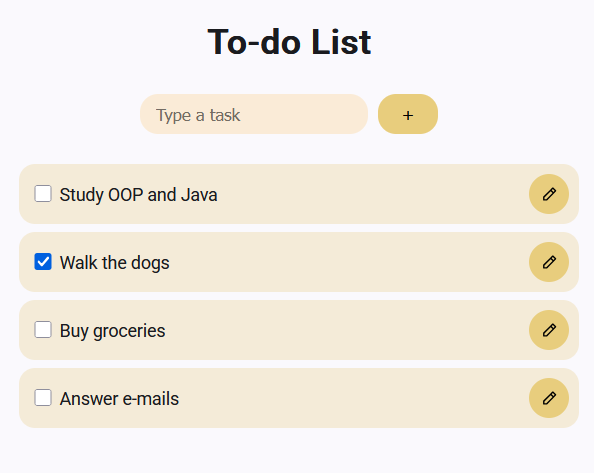
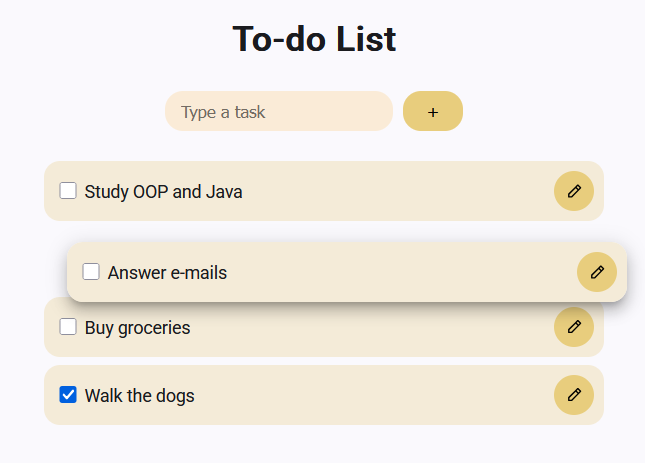

## Todo List Web App
A to-do list web application made using Angular.
<br>
Organize your to-dos with this web app!
<br><br>
Create to-dos, edit and drag and drop them the way you like.

### Libraries used
- Cdk Drag Drop
- Ng Icons (mono-icons)
- Angular Material Dialog

### Project file structure
```
├ docs/     
├ public/
├ src/
│ ├ app/
│   ├ components/
└ README.md
```

### How to execute the project on your computer
1 - Clone this repository on your computer:
`git clone https://github.com/TechFellasAbp/sprint-master.git`

2 - Open the folder, either on Terminal or VSCode, and install the dependencies with this command: `npm i`

3 - After te dependencies have installed, run the project with: `ng serve`

### Application demonstration
- Create tasks and mark them done <br><br>

<br><br>
- Reorder tasks to organize your priorities <br><br>

<br>

---

<br>
<div align="center">
    <i>Project made by Júlia Rodrigues (HeyLavenderBee)</i><br>
    <a href="https://www.linkedin.com/in/juliarodrigues3141/">Linkedin</a><br>
    2026
</div>